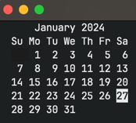

# Lazycal

lazycal is a simple Terminal UI for Calendar, built with Go.
It's being developing for users who find the 'cal' command too little, but Google Calendar too much.

# Installation

```sh
> git clone git@github.com:y-magavel/lazycal.git
> cd ./lazycal
> go build .
```

# Usage

```sh
> ./lazycal
```



# Contributing
Pull requests are welcome. 
For major changes, please open an issue first to discuss what you would like to change.

# License
[MIT License](LICENSE)